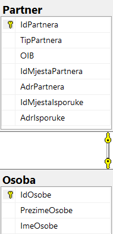
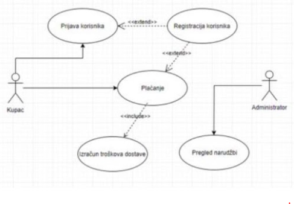
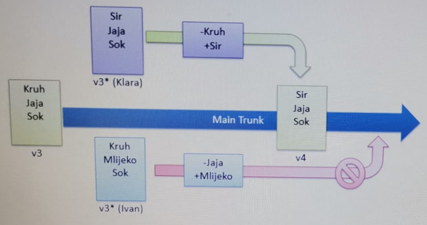

1.  Koja tvrdnja ne vrijedi za klasični vodopadni model?

    a) Problemi u slučaju pogrešaka ili novih/promijenjenih zahtjeva

    b) Razvoj započinje tek kad su svi zahtjevi dobro dokumentirani

    **c)** Iterativan postupak razvoja

    d) Slijedno napredovanje iz faze u fazu

    e) Nisu dozvoljene naknadne promjene rezultata prethodnih faza

2.  Koja od navedenih tvrdnji NIJE istinita?

    **a)** Isti naziv tipa ne smije se upotrijebiti u različitim prostorima imena.

    b) Prostor imena sadrži definicije razreda, struktura, sučelja, pobrojanih tipova, delegata i deklaraciju drugih prostora imena.

    c) C# program se može sastojati od više datoteka.

    d) Isti prostor imena može se protezati u više datoteka.

    e) Svaka datoteka sadrži jedan ili više prostora imena.

3.  Zajednički sustav tipova podataka .NET Frameworka (što se sve može definirati i pretvoriti u Intermediate Language (razredi, strukture, sučelja, delegati...)) naziva se:

    a) Common Language Runtime

    b) Assembly

    c) Base Class Library

    **d)** Common Type System

    e) Intermediate Language

4.  Zahtjevi koji opisuju zadatke koje korisnik mora moći obaviti služeći se aplikacijama su:

    a) funkcionalni

    b) poslovni

    c) obvezni

    d) nefunkcionalni

    **e)** korisnički

5.  Uz predani model MVC pogledu se iz upravljača mogu prenijeti vrijednosti koristeći:

    **a)** `ViewData` i/ili `ViewBag`

    b) `ModelData`

    c) `HtmlData` i/ili `HtmlCache`

    d) `CurrentContent` i/ili `PermanentContent`

    e) Attributes

6.  Ako se unutar pogleda u MVC aplikaciji kao model koristi razred `Mjesto` koji ima svojstvo `Naziv` čija se vrijednost ispisuje unutar pogleda, kako izgleda odsječak takvog pogleda?

    a)

    ```
    @Model Mjesto
    @model.Naziv
    ```

    **b)**

    ```
    @model Mjesto
    @Model.Naziv
    ```

    c)

    ```
    @model Mjesto
    @Naziv
    ```

    d)

    ```
    @Model Mjesto
    @Naziv
    ```

    e)

    ```
    @model Mjesto
    @Mjesto.Naziv
    ```

7.  Izvršavanjem odsječka:

    ```csharp
    try {
    	...
    	throw new NullReferenceException(...)
    }
    catch (Exception exc) {
    	Console.WriteLine("EXC");
    }
    catch (NullReferenceException nre) {
    	Console.WriteLine("NRE");
    }
    finally {
    	Console.WriteLine("F");
    }
    ```

    na ekranu se ispisuje:

    a)

    ```
    NRE
    ```

    **b)**

    ```
    EXC
    F
    ```

    c)

    ```
    NRE
    F
    ```

    d)

    ```
    EXC
    NRE
    F
    ```

    e)

    ```
    F
    ```

8.  Izbacite uljeza:

    a) višeslojna aplikacija

    b) debeli klijent

    c) tanki klijent

    **d)** hibridna aplikacija

    e) mobilna aplikacija

9.  U kojoj fazi RUP-a se prikupljaju zahtjevi?

    a) u fazi konstrukcije

    b) u fazi počinjanja

    c) u fazi prijelaza

    **d)** u svim osim u fazi prijelaza

    e) u fazi počinjanja i elaboracije

10. Hijerarhijska lista faza, zadataka i prekretnica se skraćenom naziva:

    a) Top-down

    b) PhaTaMi

    c) ABS

    d) PTM

    **e)** WBS

11. Što od navedenog nije vrijednosni tip:

    **a)** string

    b) float

    c) Nullable

    d) System.Int32

    e) int?

12. Koja razina važnosti zapisa se koristi za evidentiranje pogrešaka i iznimki koje se ne mogu obraditi te predstavljaju kritičnu pogrešku za određeni postupak, ali ne i za cijelu aplikaciju (npr. pogreška prilikom dodavanja novog podatka u bazu)?

    a) Warning

    b) Information

    c) Debug

    **d)** Error

    e) Critical

13. Koja razina važnosti zapisa se koristi za informativne poruke u cilju otklanjanja pogrešaka te predstavlja kratkoročnu informaciju (ne nužno samo programeru)?

    a) Warning

    **b)** Debug

    c) Trace

    d) Information

    e) Error

14. Način kreiranja Entity Framework modela u kojem je model opisan kroz ručno napisane razrede (bez grafičkog sučelja), a baza podataka nastaje na osnovu modela naziva se:

    a) Forward Model

    b) Migration Model

    c) Database First

    d) Model First

    **e)** Code First

15. Ako je u bazi podataka odnos među tablicama `Drzava` i `Mjesto` kao na sljedećoj slici:

    

    Razred `Drzava` u Entity Framework modelu generiranom prema navedenoj BP izgleda nalik:

    a)

    ```csharp
    public partial class Drzava {
    	...
    	public int IdMjesta { get; set; }
    	...
    	public virtual Mjesto Mjesto { get; set; }
    }
    ```

    b)

    ```csharp
    public partial class Drzava {
    	...
    	public string OznDrzave { get; set; }
    	...
    	public virtual Mjesto OznDrzaveNavigation { get; set; }
    }
    ```

    c)

    ```csharp
    public partial class Drzava {
    	...
    	public virtual Mjesto MjestoNavigation { get; set; }
    }
    ```

    d)

    ```csharp
    public partial class Drzava {
    	...
    	public int IdMjesta { get; set; }
    	...
    	public virtual ICollection<Mjesto> Mjesto { get; set; }
    }
    ```

    **e)**

    ```csharp
    public partial class Drzava {
    	...
    	public virtual ICollection<Mjesto> Mjesto { get; set; }
    }
    ```

16. Ako je u bazi podataka odnos među tablicama `Drzava` i `Mjesto` kao na slici:

    

    Razred `Mjesto` u Entity Framework modelu generiranom prema navedenoj BP izgleda nalik:

    **a)**

    ```csharp
    public partial class Mjesto
    {
    	...
    	public string OznDrzave { get; set; }
    	...
    	public Drzava OznDrzaveNavigation { get; set; }
    }
    ```

17. Parovi oblika `naziv=vrijednost` navedeni iza upitnika u adresi neke stranice (npr: `p=1&q=7&user=student` u adresi `http://apps.zpr.fer.hr/myapp/run?p=1&q=7&user=student`) tvore pojam koji se naziva:

    a) URI string

    b) GET request

    **c)** Query string

    d) POST request

    e) CGI parameter

18. U koju vrstu održavanja spada nadgradnja sustava da bi se riješili novi problemi, ili ugradnja novih mogućnosti?

    a) korektivno

    **b)** perfektivno

    c) preventivno

    d) iterativno

    e) adaptivno

19. Modularno uvođenje novog sustava u primjenu ima:

    **a)** srednji rizik, visok trošak i dugo trajanje

    b) nizak rizik, srednji trošak i kratko trajanje

    c) nizak rizik, nizak trošak i dugo trajanje

    d) srednji rizik, nizak trošak i dugo trajanje

    e) visok rizik, nizak trošak i dugo trajanje

20. Testiranje u kojem se provjerava kako cjelina radi, a probni slučajevi izvode se uvidom u programski kod naziva se:

    a) kritično testiranje (red-box testing)

    b) testiranje autentičnosti (gray-box testing)

    c) funkcionalno testiranje (black-box testing)

    **d)** strukturalno testiranje (white-box testing)

    e) ekološko testiranje (green-box testing)

21. Testiranje u kojem se provjerava što cjelina radi, to jest zadovoljava li zahtjeve pri čemu se probni slučajevi izvode iz specifikacija naziva se:

    a) testiranje autentičnosti (gray-box testing)

    b) strukturalno testiranje (white-box testing)

    c) ekološko testiranje (green-box testing)

    d) kritično testiranje (red-box testing)

    **e)** funkcionalno testiranje (black-box testing)

22. Testiranje jesu li zadovoljeni izvorni poslovni zahtjevi naziva se:

    **a)** testiranje zahtjeva (requirements testing)

    b) funkcionalno testiranje (black-box testing)

    c) poslovno testiranje (business testing)

    d) strukturalno testiranje (white-box testing)

    e) testiranje autentičnosti (gray-box testing)

23. Ako je u bazi podataka odnos među tablicama Drzava i Mjesto kao na sljedećoj slici:

    

    a odgovarajući context Entity Frameworka pohranjen u varijabli `ctx`, koji od navedenih odsječaka ispravno vraća listu objekata koji imaju svojstva koja predstavljaju naziv mjesta i naziv države:

    **a)**

    ```csharp
    var list = ctx.Mjesto
      .Select(m => new {
            m.NazivMjesta,
            Drzava = m.OznDrzaveNavigation.NazDrzave
      }).ToList();
    ```

24. Parcijalni razred je razred:

    **a)** čija definicija može biti napisana u više datoteka.

    b) koji nema implementirane sve postupke.

    c) koji se ne može instancirati.

    d) koji sadrži samo popis postupaka.

    e) koji je napisan u nekoliko prostora imena.

25. Sljedeći programski odsječak:

    ```csharp
    class Primjer
    {
    	private int index;
    	public int Index
    	{
    		get { return index; }
    		set {
    			if (value <= 0) { this.index = 0; }
    			else if (value > 100) { this.index = 100; }
    			else { this.index = value; }
    		}
    	}
    }
    ```

    je primjer:

    a) tvrdnje

    b) ofenzivnog programiranja

    c) iznimke

    d) indeksera

    **e)** barikade

26. "Parser će brzo generirati izvješće o pogreškama HTML oznaka, koje omogućava brzi ispravak pogrešaka kada program koriste početnici u HTML-u." Ovo je primjer:

    a) zahtjeva vlasnika sustava

    b) neostvarivog zahtjeva

    c) zahtjeva krajnjih korisnika

    **d)** neodređenog zahtjeva

    e) nepotpunog zahtjeva

27. Ako je REST servis firma oblikovan prema standardu OData tada se artikl sa šifrom 8 nalazi na sljedećoj adresi:

    **a)** `http://.../firma/artikl(8)`

28. Ako je u bazi podataka odnos među tablicama `Partner` i `Osoba` kao na slici:

    

    Razred `Osoba` u Entity Framework modelu generiranom prema navedenoj BP izgleda nalik:

    a)

    ```csharp
    public partial class Osoba {
          ...
          public int IdPartnera { get; set; }
          ...
          public ICollection<Partner> IdOsobeNavigation { get; set; }
    }
    ```

    **b)**

    ```csharp
    public partial class Osoba {
          ...
          public int IdOsobe { get; set; }
          ...
          public Partner IdOsobeNavigation { get; set; }
    }
    ```

    c)

    ```csharp
    public partial class Osoba {
    	...
    	public ICollection<Partner> Partner { get; set; }
    }
    ```

    d)

    ```csharp
    public partial class Osoba
    {
          ...
          public int IdOsobe { get; set; }
    }
    ```

29. U slučaju da svaki od korisnika (ili svaka od grupa korisnika) koristi bazu podataka koja nije javno dostupna ili je njihov broj velik, a strukturu baze podataka je potrebno mijenjati prilikom ažuriranja aplikacije, prikladan pristup za izradu Entity Framework modela je:

    **a)** code first with migrations

30. Za upit definiran s `SELECT OznDrzave, NazDrzave FROM Drzava;` i odgovarajuće instanciranje objekata tipa `DbCommand` i `IDataReader` za gore navedenu naredbu, što od navedenog NIJE ispravan način dohvata vrijednosti nekog retka u tablici `Drzava`?

    a)

    ```csharp
    string oznaka = (string) reader["OznDrzave"];
    string naziv = (string) reader["NazDrzave"];
    ```

    b)

    ```csharp
    string oznaka = reader.GetString(0);
    string naziv = reader.GetString(1);
    ```

    c)

    ```csharp
    string oznaka = reader["OznDrzave"].ToString();
    string naziv = reader["NazDrzave"].ToString();
    ```

    **d)**

    ```csharp
    string oznaka = (string) reader.GetName("OznDrzave");
    string naziv = (string) reader.GetName("NazDrzave");
    ```

31. Što od navedenog nije faza testiranja?

    a) testiranje jedinica

    b) integracijsko testiranje

    **c)** testiranje autentičnosti

    d) test prihvatljivosti

    e) test sustava

32. U programskom odsječku:

    ```csharp
    void IspisiVozila(IEnumerable<MotornoVozilo> vozila) {
          foreach(var vozilo in vozila)
                Console.WriteLine(vozilo.Model);
    }
    ```

    ako `Automobil` i `Motocikl` nasljeđuju `MotornoVozilo`, onda je u postupak `IspisiVozilo` moguće poslati i `List<Automobil>`, jer je sučelje `IEnumerable<T>`:

    **a)** kovarijantno

    b) varijantno

    c) irelevantno

    d) kontravarijantno

    e) invarijantno

33. Koja razina važnosti zapisa se koristi za evidentiranje zapisa trajnijeg karaktera koji služi za praćenje toka rada aplikacije (npr. informacija o posjetu određenoj stranici ili evidencija postavljenih kriterija pretrage)?

    a) Warning

    **b)** Information

    c) Debug

    d) Error

    e) Critical

34. Način kreiranja Entity Framework modela u kojem baza podataka već postoji i model nastaje reverznim inženjerstvom BP naziva se:

    a) Reverse Model

    b) Migration Model

    c) Forward Model

    **d)** Database First

    e) Model First

35. Želimo li da WebApi servis automatski izvrši provjeru primljenog modela te vrati status 400 u slučaju validacijskih pogrešaka, upravljaču ćemo dodati atribut:

    **a)** `ApiController`

    b) `TypeFilter`

    c) `BadRequestFilter`

    d) `ControllerBase`

    e) `ExceptionFilter`

36. Što od navedenog nije točno za koncept "Code first from existing database"?

    a) "Code first from existing database" koristi tehniku reverznog inženjerstva

    b) "Code first from existing database" je sličan konceptu "Code first", ali radi s postojećom bazom podataka

    c) Razredi se mogu stvoriti ručno ili nekim od generatora

    d) Baza podataka opisuje se razredima, ali ne uzrokuje stvaranje nove bazepodataka

    **e)** Za "Code first from existing database" potrebno je koristiti grafičko sučelje

37. Postupak dokazivanja da je napravljen pravi proizvod koji odgovara namjeni te da je prihvatljiv korisniku naziva se:

    **a)** validacija

38. Koja razina važnosti zapisa se koristi za evidentiranje situacija koje uzrokuju prekid rada cijele aplikacije (npr. nedostatak prostora na disku, neispravne postavke za spajanje na bazu podataka, itd.)?

    a) Error

    b) Debug

    c) Information

    d) Trace

    **e)** Critical

39. Ako je REST servis firma oblikovan prema standardu OData tada se artikli u cjenovnom rasponu od 100 do 500 mogu dohvatiti sa sljedeće adrese:

    **a)** `http://.../firma/artikl?$filter=CijArtikla gt 100 and CijArtikla lt 500`

40. Ako referenca `x` pokazuje na objekt neke klase u kojoj je definirano sljedeće:

    ```csharp
    public string this[int a, int b] {
    	get {
    		...
    	}
    	set {
    		...
    	}
    }
    ```

    koja od sljedećih konstrukcija je ispravna?

    a) `x["A", 5] = 1 + x["B", 3]`

    **b)** `x[1, 5] = "Z" + x[2, 3]`

    c) `x(1, 2) = "Z"`

    d) `x.this[1, 2] = "Z"`

    e) `x["Z"] = (1, 2)`

41. Želimo li definirati novi korisničko-definirani tip delegata za pridruživanje referenci na metode koje primaju dva cijela broja i vraćaju double broj, tada ćemo napisati:

    **a)** `public delegate double Tip(int a, int b)`

    b) `public delegate<int, int, double> Tip`

    c) public delegate Tip(int a, int b, double result)

    d) public class Tip : delegate double(int a, int b)

    e) public class Tip : MulticastDelegate<int, int, double>

42. U slučaju da trebamo definirati delegat kojem trebamo pridružiti referencu na metodu koja prima dva cijela broja i vraća double broj, tada ćemo upotrijebiti:

    **a)** `Func<int, int, double>`

    b) `Func<int<,>, double>`

    c) `Action<int, int, double>`

    d) `Func<Action<int, int>, double>`

    e) `Func<double, int, int>`

43. Označite uloge u Scrumu (Napomena: Pitanje ima više točnih odgovora)

    a) Team leader

    **b)** Team

    **c)** Product Owner

    **d)** Scrum Master

    e) Agile Coach

44. Tehnika programiranja čija je ideja da će potprogram s neispravnim podacima "opstati" i onda kada su pogreškom pozivajuće procedure predani neispravni argumenti, naziva se:

    **a)** Defanzivno programiranje

45. Što od navedenog nije način prikupljanja zahtjeva:

    a) radne sjednice

    b) promatranje (etnografski pristup)

    **c)** team building

    d) analiza dokumentacije

    e) upitnici i ankete

46. Što predstavlja sljedeća slika:

    

    **a)** dijagram slučajeva korištenja

47. Koja razina važnosti zapisa se koristi za evidentiranje pogrešaka koje ne utječu na daljnji rad aplikacije, ali predstavljaju potencijalno opasne situacije te zahtijevaju naknadnu pažnju (npr konfiguracijska datoteka ne sadrži traženu vrijednost, pa se koristi predodređena)?

    a) Information

    **b)** Warning

    c) Debug

    d) Error

    e) Trace

48. "Sustav mora raditi bez pogreške i davati rezultate u realnom vremenu" je primjer:

    **a)** neprovjerljivog zahtjeva

49. Ovo:

    ```
    1. Introduction
          1.1. Project Overview
          1.2. Project Deliverables
          1.3. Evolution of the Software Project Management Plan
          1.4. Reference Materials
          1.5. Definitions and Acronyms
    2. Project Organization
          2.1 Process Model
          2.2 Organizational Structure
          2.3 Organizational Boundaries and Interfaces
          2.4 Project Responsibilities
    3. Managerial Process
          3.1 Management Objectives and Priorities
          3.2 Assumptions, Dependencies, and Constraints
          3.3 Resource Requirements
          3.4 Budget and Resource Allocation
          3.5 Schedule
    6. Additional Components
    7. Index
    8. Appendices
    ```

    je predložak:

    **a)** Plana projekta

50. Izvođenjem sljedećeg programskog odsječka:

    ```csharp
    int a = 0, b = 0, c;
    try {
          try {
                Console.Write("T1 ");
                c = b / a;
          }
          finally {
                Console.Write("F1 ");
          }
    }
    catch (Exception exc2) {
          Console.Write("E2 ");
    }
    finally {
          Console.Write("F2 ");
    }
    ```

    na ekranu će se ispisati:

    **a)** `T1 F1 E2 F2`

51. Izvođenjem sljedećeg programskog odsječka:

    ```csharp
    try {
          try {
                Console.Write("T1 ");
          }
          finally {
                Console.Write("F1 ");
          }
    }
    catch (Exception exc2) {
          Console.Write("E2 ");
    }
    finally {
          Console.Write("F2 ");
    }
    ```

    na ekranu će se ispisati:

    **a)** `T1 F1 F2`

52. Ako unutar plana projekta kalendar za neku osobu evidentira radno vrijeme od ponedjeljka do petka od 8 do 12, onda 75% raspoloživosti te osobe znači da je radno vrijeme te osobe:

    **a)** 15 sati rada tjedno

53. Ako u konfiguracijskoj datoteci za klijentske biblioteke (npr `bower.json` ili `packages.json`) želimo u budućnosti uključiti noviju verziju jQueryja sve dok je ona oblika 3.minor.patch, a u trenutku pisanja postoji verzija 3.3.1 napisat ćemo:

    **a)** `"jQuery": "~3.3.1"`

54. Informacijski sustav je:

    **a)** sustav aplikacija za upravljanje ljudskim aktivnostima

55. `private` modifikator pristupa razredima i članovima označava:

    **a)** pristup ograničen na razred u kojem je član definiran

56. Ako je u bazi podataka odnos među tablicama `Partner` i `Osoba` kao na slici:

    

    Razred `Partner` u Entity Framework modelu generiranom prema navedenoj BP izgleda nalik:

    **a)**

    ```csharp
    public partial class Partner
    {
          ...
          public int IdOsobe { get; set; }
          ...
          public Osoba IdOsobeNavigation { get; set; }
    }
    ```

    b)

    ```csharp
    public partial class Partner
    {
          ...
          public int IdPartnera { get; set; }
          ...
          public Partner IdOsobe { get; set; }
    }
    ```

57. Koje su faze RUP-a?

    **a)** Počinjanje, elaboracija, konstrukcija i prijelaz

58. Konfiguracija je:

    **a)** Imenovani skup hardvera i/ili softvera koji se tretira kao jedinka u procesu upravljanja konfiguracijom

59. Ako unutar plana projekta kalendar za neku osobu evidentira radno vrijeme utorkom i srijedom od 12 do 15, onda 200% raspoloživosti te osobe znači da je radno vrijeme te osobe:

    **a)** 12h tjedno

60. Prikupljanje najvažnijih zahtjeva se kod RUP-a prikuplja u fazi:

    **a)** počinjanja

61. Ako je definiran sljedeći razred:

    ```csharp
    class GenRazred<T> where T : class {
    	...
    }
    ```

    što od navedenog nije ispravno:

    a) `GenRazred<List<int>> x;`

    b) `GenRazred<Exception> x;`

    c) `GenRazred<string> x;`

    **d)** `GenRazred<System.Int32> x;`

    e) `GenRazred<List<string>> x;`

62. Označite fundamentalne aktivnosti u svakom procesu razvoja softvera. (Napomena: pitanje ima više točnih odgovora)

    **a)** evolucija

    **b)** specificiranje

    **c)** validacija

    **d)** dizajn i implementacija

    e) kontinuirana isporuka

63. Svi tipovi podataka u jeziku C# izvode se iz tipa:

    **a)** `System.Object`

64. Što od navedenog nije jedno od 4 osnovna pravila servisno orijentirane arhitekture?

    **a)** Brzina i mala količina podataka

    b) Neovisnost servisa

    c) Semantika, a ne samo sintaksa

    d) Jasno određene granice

    e) Ugovor, a ne implementacija

65. Novi/drugi naziv za Swagger je:

    **a)** OpenAPI

    b) RESTful

    c) REST API

    d) JSON

    e) OData

66. Komentari unutar serverskog koda nekog MVC pogleda imaju oblik:

    **a)** `@* komentar koji se neće pojaviti u generiranom html-u *@`

67. Izbaci uljeza:

    a) vodopadni model

    b) RUP

    **c)** UML

    d) XP

    e) Scrum

68. "Sustav moraju moći koristiti osobe starije životne dobi" je primjer:

    **a)** neprovjerljivog zahtjeva

69. Prilikom upravljanja zahtjeva o usvajanju i postavljanju prioriteta i rokova odlučuje:

    **a)** Odbor za promjene (Change Control Board)

70. Koje vrste resursa postoje?

    **a)** Ljudski i materijalni

71. Logička naredba (postupak u C#) kojom se program testira tako da njen uvjet mora biti istinit, a ukoliko nije, program pada, naziva se:

    **a)** Tvrdnja (Assert)

72. U koju vrstu održavanja spada popravak nakon što se problem pojavio?

    **a)** korektivno

73. Izvođenjem sljedećeg programskog odsječka:

    ```csharp
    class Razred : IDisposable {
          private string Naziv;

          public Razred(string Naziv) {
                this.Naziv = Naziv;
          }

          public void Dispose() {
                Console.WriteLine(Naziv);
          }
    }

    class Program {
          static void Main(string[] args) {
                try {
                      Razred r1 = new Razred("A1");
                      using (Razred r2 = new Razred("B2")) {
                            Razred r3 = new Razred("C3");
                            r3 = null;
                            throw new Exception("Poruka");
                      }
                      r1.Dispose();
                }
                catch { }
          }
    }
    ```

    odnosno ako je razred `Razred` implementiran tako da u postupku `Dispose` ispisuje parametar primljen u konstruktoru, na ekranu će se ispisati:

    a) `C3`

    b) `B2 C3`

    **c)** `B2`

    d) `B2 A1`

    e)` B2 C3 A1`

74. Paralelno uvođenje novog sustava u primjenu ima:

    **a)** nizak rizik, visok trošak i dugo trajanje

75. Što od navedenog nije istina za distribuirane sustave za upravljanje verzijama izvornog koda?

    a) ne mora postojati zajednički centralni repozitorij

    b) repozitorij se može kopirati na neko drugo mjesto

    c) ako postoji udaljeni repozitorij korisnik može osvježiti svoju verziju promjenama s udaljenog repozitorija i obrnuto

    d) korisnik ima kopiju repozitorija i povijest izmjena

    **e)** svaka potvrđena promjena u repozitoriju inkrementalno povećava broj verzije

76. Izvođenjem sljedećeg programskog odsječka:

    ```csharp
    static void Main(string[] args) {
    	Action<Func<int, int, int>> action = (f1) => Console.WriteLine(f1(5, 20));

    	action += (f2) => Console.WriteLine(f2(3, 6));
    	action((f1, f2) => f1 + f2);
    }
    ```

    na ekranu će se ispisati:

    **a)**

    ```
    25
    9
    ```

77. U planu projekta vrijedi sljedeća formula:

    **a)** Posao = Trajanje \* jedinice (work = duration \* units)

78. Metodologija razvoja softvera koji sadrži niz predložaka razvojnih procesa za različite modele razvoja, a obavlja se kroz razvojne faze koje su organizirane u iteracije, poznata je pod skraćenicom:

    **a)** RUP

79. Iteracija u Scrumu se naziva:

    **a)** sprint

80. Ako `Automobil` i `Motocikl` nasljeđuju `MotornoVozilo` i ako je sučelje `IComparer` definirano kao `public interface IComparer<in T>`, tada se postupku:

    ```csharp
    void IspisiBoljiMotor(Motocikl a, Motocikl b, IComparer<Motocikl> comparer) {
    	Console.WriteLine(comparer.Compare(a, b) < 0 ? a : b);
    }
    ```

    argument (comparer) može poslati objekt tipa:

    **a)** `IComparer<MotornoVozilo>`

81. Dokazivanje da proizvod zadovoljava zahtjeve i uvjete preuzimanja naziva se:

    **a)** provjera prihvatljivosti

    b) testiranje korisničkog sučelja

    c) testiranje performansi

    d) testiranje standardnosti

    e) testiranje dokumentacije

82. Izbacite uljeza:

    a) `FromQuery`

    **b)** `FromScript`

    c) `FromRoute`

    d) `FromServices`

    e) `FromForm`

83. Razvoj i upravljanje zahtjevima zajedno čine:

    **a)** Inženjerstvo zahtjeva

84. Koje 3 "dimenzije" se vežu uz konverziju sustava?

    **a)** stil, lokacija, modularnost

85. Koje su varijante vodopadnog modela razvoja?

    **a)** Klasični, pseudostrukturni i radikalni

86. WSDL označava:

    a) Protokol za razmjenu informacija u distribuiranim, heterogenim okruženjima

    b) Mehanizam za povezivanje udaljenih postupaka.

    **c)** XML shemu za opis web servisa.

    d) Postupak lociranja web servisa.

    e) Atribut kojim se označava postupak web servisa.

87. Ako je razred `Car` izveden iz razreda `Vehicle`, a metoda `M` definirana s `void M(List<Vehicle> list)` tada u metodu `M` možemo poslati objekt(e) tipa:

    **a)** `List<Vehicle>`

    b) `List<Vehicle>` i `List<Car>`

    c) `IEnumerable<Vehicle>` i `List<Vehicle>`

    d) `List<Vehicle>`, `List<Car>`, `IEnumerable<Vehicle>` i `IEnumerable<Car>`

    e) `IEnumerable<Vehicle>` i `IEnumerable<Car>`

88. `internal` modifikator pristupa razredima i članovima razreda označava:

    **a)** pristup ograničen na program u kojem je razred definiran

89. Što predstavlja primjer sa slike?

    

    **a)** Konfliktnu situaciju zbog istovremenih promjena iste datoteke

90. Koji od sljedećih programskih odsječaka je točan?

    **a)**

    ```csharp
    int a = 1, b = 2;
    M(ref a, out b);
    ...
    void M(ref int a, out int b) {
    	b = 20;
    }
    ```

91. Što je od navedenog neispravno za postupak WebAPI servisa izvedenog iz `ControllerBase`? Napomena: `Tools` i `Categories` su vlastiti razredi. Pitanje ima više točnih odgovora, tj više izraza je neispravno.

    a)

    ```csharp
    [HttpPost]
    public IActionResult Assign([FromQuery] Tools tools, [FromQuery] Categories categories)
    ```

    **b)**

    ```csharp
    [HttpPost]
    public IActionResult Assign(Tools tools, Categories categories)
    ```

    **c)**

    ```csharp
    [HttpPost]
    public IActionResult Assign([FromBody] Tools tools, [FromBody] Categories categories)
    ```

    d)

    ```csharp
    [HttpPost]
    public IActionResult Assign([FromBody] Tools tools, [FromQuery] Categories categories)
    ```

    e)

    ```csharp
    [HttpPost]
    public IActionResult Assign(Tools tools, [FromServices] Categories categories)
    ```

92. Ako je `SifArtikla` primarni ključ za tablicu `Artikl` te ako prije izvođenja programskog odsječka u tablici `Artikl` nije bilo artikala sa šiframa 0-5, izvođenjem sljedećeg programskog odsječka:

    ```csharp
    using (var context = new FirmaContext())
    {
    	for (int i = 1; i <= 10; i++)
    	{
    		Artikl artikl = new Artikl
    		{
    			SifArtikla = i/2, CijArtikla = 10m,
    			JedMjere = "kom", NazArtikla = i.ToString()
    		}
    		context.Artikl.Add(artikl);
    	}
    	context.SaveChanges();
    }
    ```

    broj zapisa u tablici `Artikl` povećat će se za:

    **a)** 6

93. Plan projekta je dokument koji:

    a) Opisuje fazu analize

    b) Skicira zadatke koji će se pojaviti u početku razvoja sustava

    **c)** Opisuje sveukupnu organizaciju projekta

    d) Detaljno dokumentira funkcionalnost proizvoda

    e) Sumira poslovnu potrebu i objašnjava kako predloženi sustav podržava tu potrebu i kreira vrijednost

94. Generičko sučelje definiramo modifikatorom `out`, npr. `public interface IEnumerable<out T>` je:

    **a)** kovarijantno

95. U koju vrstu održavanja spada zaštita od mogućih problema?

    **a)** preventivno

96. Ako je REST servis firma oblikovan prema standardu OData tada se prva 3 artikla poredana po cijeni silazno mogu dohvatiti na adresi:

    **a)** `http://.../firma/artikl?$top=3&$orderby=CijArtikla desc`

    b) `http://.../firma/artikl(3)/By/CijArtikla`

    c) `http://.../firma/artikl/3?orderBy=CijArtikla&desc=true`

    d) `http://.../firma/artikl?$top=3&$filter=CijArtikla desc`

    e) `http://.../firma/3/artikl>$$by=CijArtiklaDesc`

97. Planiranje s dna prema gore (Bottom-up) je jedan od pristupa razvoju zadataka i faza u kojem:

    **a)** se identificiraju zadaci najnižeg sloja prije grupiranja u faze

98. Izbacite uljeza:

    a) `FromBody`

    b) `FromRoute`

    **c)** `FromApi`

    d) `FromForm`

    e) `FromHeader`

99. Izvođenjem sljedećeg programskog odsječka:

    ```csharp
    static void Main(string[] args) {
    	Action<int, string, Func<char, string, int>> action = (i, s, f) => Console.WriteLine(f(s[i], s));
    	action(6, "ispit iz RPPP-a", (x, s) => {
    		int sum = 0;
    		foreach (var c in s) {
    			if (x == c) {
    				++sum;
    			}
    		}
    		return sum;
    	});
    }
    ```

    na ekranu će se ispisati:

    **a)** 3

100.  Što od navedenog nije preporuka za korištenje iznimki?

      a) Izbjegavati prazne blokove za hvatanje iznimki (“catch{}”)

      b) Ne bacati iznimke za pogreške koje se mogu obraditi lokalno

      c) U poruci iznimke uključiti sve informacije o kontekstu nastanka iznimke

      d) Bacati iznimke samo u stanjima koja su stvarno iznimka

      **e)** Iznimke koristiti samo u fazi razvoj (tj u debug verziji aplikacije)

101.  Test kojeg provode nezavisne tvrtke ili odjeli za osiguranje kvalitete, a provodi se opcionalno kao potvrda da je sustav gotov i spreman za primjenu naziva se:

      **b)** Nadzorni test (audit test)

102.  Želimo li u nekoj akciji upravljača preusmjeriti korisnika na akciju `Create` istog upravljača, upotrijebit ćemo naredbu:

      **a)**

      ```csharp
      return RedirectToAction("Create");
      ```

103.  U inženjerstvu zahtjeva, neformalni opis zamišljene interakcije korisnika i sustava naziva se:

      **a)** scenarij

104.  Što je programsko inženjerstvo?

      **a)** sistematičan, discipliniran i mjerljiv pristup razvoju, primjeni i održavanju softvera

105.  Ako ispred naziv razreda, sučelja, delegata i događaja nije naveden modifikator podrazumijeva se da je on

      **a)** internal

106.  U kojoj fazi ekstremnog programiranja je vrijeme da se napiše sva korisnička dokumentacija, budući da više nema promjena u arhitekturi, dizajnu i kodu sustava?

      **a)** faza smrti

107.  Ako `Automobil` i `Motocikl` nasljeđuju `MotornoVozilo` i ako je sučelje `IEnumerable` definirano kao `public interface IEnumerable<out T>`, tada se postupku:

      ```csharp
      void IspisiVozila(IEnumerable<MotornoVozilo> vozila) {
            foreach(var vozilo in vozila)
                  Console.WriteLine(vozilo.Model);
      }
      ```

      kao argument može poslati objekt tipa:

      **a)** `List<Automobil>`

      b) `List<IEnumerable<Motocikl>>`

      c) `Motocikl`

      d) sve od navedenog

      e) `Automobil`

108.  Što od navedenog NIJE istina za centralizirane sustave za upravljanje verzijama izvornog koda?

      a) Korisnik ima sve ili dio datoteke iz repozitorija pri čemu nije nužno da ima zadnju verziju

      **b)** Promjene započinju najavom izmjena datoteka (tzv. checkout) što može uključivati dohvat zadnje verzije datoteke i onemogućavanje ažuriranja te datoteke ostalim korisnicima

      **c)** S centraliziranim sustavom može doći do konflikta verzija

      d) Postoji samo jedan centralni repozitorij

      e) Korisnik ima kopiju repozitorija i povijest izmjena

109.  Kako se naziva skup osnovnih razreda platforme .NET Framework koje programer može slobodno koristiti pri realizaciji svojih programa?

      **a)** Base Class Library

110.  Faze životnog ciklusa programske potpore su:

      **a)** planiranje, analiza, oblikovanje, izrada, primjena i pregled

111.  Što je od navedenog istina za zahtjeve?

      a) Zahtjevi trebaju sadržavati detalje dizajna i implementacije

      b) Svaki zahtjev razdvojiti na četiri podzahtjeva: poslovni, tehnički, operativni i konceptualni

      c) Prijedlog rješenja je zahtjev

      **d)** Usmjeriti se na ono što je potrebno obaviti, a ne na način realizacije

      e) Kopirati koncept kako se odsad određeni posao radio i ugraditi ga na isti način

112.  Nefunkcionalni zahtjevi odgovaraju na pitanje:

      **a)** kako ili kako dobro

113.  Za koju od sljedećih skraćenica se može reći da je distribuirani sustav u kojem sudjeluje više autonomnih servisa međusobno šaljući poruke preko granica određenih procesom, mrežom, itd.

      **a)** SOA

114.  Koji od navedenih odsječaka nije ispravan C#-u?

      **a)** Svi odsječci su ispravni

      b)

      ```csharp
      dynamic s = 7;
      ```

      c)

      ```csharp
      dynamic s;
      ```

      d)

      ```csharp
      dynamic s;
      s = 12;
      s = "Pero";
      ```

      e)

      ```csharp
      dynamic s; s = "Pero";
      s = 12;
      ```

115.  Koji od navedenih pojmova nije neka vrsta aplikacije?

      **a)** umetnuta aplikacija

      b) poslužiteljska aplikacija

      c) samostalna aplikacija

      d) višeslojna aplikacija

      e) mobilna aplikacija

116.  Izvođenjem sljedećeg programskog odsječka:

      ```csharp
      int a = 0, b = 0, c;
      try {
      	try {
      		Console.Write("T1 ");
      		c = b / a;
      	}
      	catch (Exception exc) {
      		Console.Write("E1 ");
      		c = a / b;
      	}
      	finally {
      		Console.Write("F1 ");
      	}
      }
      catch (Exception exc2) {
      	Console.Write("E2 ");
      }
      finally {
      	Console.Write("F2 ");
      }
      ```

      na ekranu će se ispisati:

      **a)** `T1 E1 F1 E2 F2`

117.  Za prijenos podataka unutar dvaju zahtjeva u MVC aplikaciji (npr. prilikom akcija brisanja nekog elementa i preusmjeravanja na neku drugu akciju) koristi se:

      **a)** `TempData`

118.  Kako se naziva tip podatka čija deklaracija sadrži naziv standardnog vrijednosnog tipa i upitnik (npr. int? num)?

      **a)** nulabilni tip

119.  Koja razina važnosti zapisa se koristi za bilježenje malih koraka izvođenja programa i ispis informacija namijenjenih programeru u cilju lakšeg rješavanja problema?

      a) Information

      b) Warning

      c) Debug

      d) Error

      **e)** Trace

120.  Što od navedenog ne spada u verifikaciju zahtjeva?

      a) pisanje korisničkog priručnika

      b) pisanje testova i probnih slučajeva

      c) provjeru dokumentacije sa zahtjevima

      d) definiranje kriterija prihvatljivosti

      **e)** komentiranje koda

121.  U kojoj fazi životnog ciklusa programske potpore se modeliraju procesi?

      **a)** analiza

122.  Konverzija sustava je:

      **a)** tehnički proces u kojem novi sustav zamjenjuje stari sustav

123.  Ako je u WebAPI upravljaču definirano sljedeće:

      ```csharp
      public class MjestoController : ControllerBase {
      	...
      	[HttpPost]
      	public IActionResult Create(string s, int i) {
      		...
      	}
      }
      ```

      Argumenti će se:

      **a)** rekonstruirati iz query stringa

124.  Koje vrste projektnih zadataka postoje?

      **a)** primitivni, skupni i prekretnice

125.  U kojoj fazi životnog ciklusa programske potpore se vrši analiza izvedivosti (i izvještaja?)?

      **a)** planiranje

126.  Verzija konfiguracije koja se koristi umjesto originalne verzije i podrazumijeva izmjene nastale kroz vrijeme naziva se:

      **a)** revizija

127.  Ako postoji barikada, tvrdnje i obrada iznimki trebaju biti korištene na način da:

      **a)** se obrade iznimki nalaze u postupcima s vanjske strane barikade, a tvrdnje u postupcima s unutarnje strane barikade

128.  Koji nivo Richardsonovog modela zrelosti zadovoljava web-servise koji koriste SOAP protokol?

      **a)** 0

129.  Za prijenos varijabilnog broja argumenata koristi se ključna riječ:

      **a)** params

130.  Ako je `R` definiran na sljedeći način:

      ```csharp
      class R {
      	public int X { get; set; }
      	public int Y { get; set; }
      	public R() : this(5, 6) { }
      	public R(int x) {
      		Y = x;
      	}
      	public R(int a, int b) {
      		X = a;
      		Y = b;
      	}
      }
      ```

      tada će se izvođenjem sljedećeg programskog odsječka:

      ```csharp
      R r = new R {
      	X = 7
      };
      Console.WriteLine(r.X + " " + r.Y);
      ```

      na ekranu ispisati:

      **a)** `7 6`

131.  U kojoj fazi ekstremnog programiranja korisnici bilježe svoje priče na kartice, a svaka kartica sadrži jednu mogućnost programa?

      a) U fazi održavanja

      b) U fazi planiranja

      c) U fazi produkcije

      d) U fazi analize

      **e)** U fazi istraživanja

132.  Način kreiranja Entity Framework modela u kojem se model dizajnira korištenjem grafičkog sučelja, a baza podataka nastaje na osnovu modela naziva se:

      a) Database First

      b) Migration Model

      c) Forward Model

      **d)** Model First

      e) GUI Model

133.  Što od navedenog nije pojam koji se veže uz verziju konfiguracije?

      **a)** Inspekcija (inspection)

134.  Povelja projekta je:

      **a)** Dokument kojim pokretač projekta ili sponzor odobrava projekt

135.  Neka su definirane sljedeće hijerarhije:

- `Vozilo` <- `Automobil` <- `ElektricniAutomobil`
- `Vozilo` <- `Motocikl`
- `Osoba` <- `Djelatnik` <- `Direktor`

  i postupak `Djelatnik ZaduzenZa(Automobil a)`.

  Što od navedenog nije ispravno?

  **a)**

  ```csharp
  Func<ElektricniAutomobil, Direktor> func = ZaduzenZa;
  ```

  b)

  ```csharp
  Func<ElektricniAutomobil, Osoba> func = ZaduzenZa;
  ```

  **c)**

  ```csharp
  Func<Vozilo, Direktor> func = ZaduzenZa;
  ```

  **d)**

  ```csharp
  Func<Vozilo, Osoba> func = ZaduzenZa;
  ```

  **e)**

  ```csharp
  Func<Vozilo, ElektricniAutomobil> func = ZaduzenZa;
  ```

136.  Neka su definirane sljedeće hijerarhije:

- `Vozilo` <- `Automobil` <- `ElektricniAutomobil`
- `Vozilo` <- `Motocikl`
- `Osoba` <- `Djelatnik` <- `Direktor`

  i postupak `void Zaduzi(Automobil a, Djelatnik D)`.

  Što je od navedenog ispravno?

  a)

  ```csharp
  Action<Vozilo, Direktor> action = Zaduzi;
  ```

  b)

  ```csharp
  Func<ElektricniAutomobil, Osoba> action = Zaduzi;
  ```

  c)

  ```csharp
  Action<Vozilo, Osoba> action = Zaduzi;
  ```

  **d)**

  ```csharp
  Action<ElektricniAutomobil, Direktor> action = Zaduzi;
  ```

  e)

  ```csharp
  Action<ElektricniAutomobil, Osoba> action = Zaduzi;
  ```

140.  Ako unutar plana projekta kalendar za neku osobu evidentira radno vrijeme utorkom i srijedom od 12-15, onda 50% raspoloživosti osoba znači da je radno vrijeme osoba:

      **a)** 3 sata rada tjedno

141.  Ako WebApi (REST) servis uspješno ažurira postojeći podatak korisniku će se vratiti statusna poruka čiji je statusni kod:

      a) 205 RESET CONTENT

      b) 410 GONE

      c) 404 NOT FOUND

      **d)** 204 NO CONTENT

      e) 301 MOVED PERMANENTLY

      f) 302 FOUND (REDIRECT)

      g) 201 CREATED

142.  Ako WebApi (REST) servis uspješno doda novi podatak korisniku će se vratiti statusna poruka čiji je statusni kod:

      a) 205 RESET CONTENT

      b) 410 GONE

      c) 404 NOT FOUND

      d) 204 NO CONTENT

      e) 301 MOVED PERMANENTLY

      f) 302 FOUND (REDIRECT)

      **g)** 201 CREATED

143.  Ako WebApi (REST) servis uspješno obriše podatak korisniku će se vratiti statusna poruka čiji je statusni kod:

      a) 205 RESET CONTENT

      b) 410 GONE

      c) 404 NOT FOUND

      **d)** 204 NO CONTENT

      e) 301 MOVED PERMANENTLY

      f) 302 FOUND (REDIRECT)

      g) 201 CREATED

144.  Uz pretpostavku da u tablici `Artikl` postoje 2 artikla sa šifrom manjom od 3, izvođenjem sljedećeg programskog odsječka:

      ```csharp
      using (var context = new FirmaContext())
      {
      	List<Artikl> artikli = context.Artikl
      		.AsNoTracking()
      		.Where(a => a.SifArtikla < 3)
      		.ToList();
      	artikli[0].CijArtikla += 10m;
      	artikli[1].CijArtikla = artikli[0].CijArtikla;
      	context.SaveChanges();
      }
      ```

      na bazi podataka izvest će se:

      **a)** 1 `SELECT` upit i 0 `UPDATE` upita

145.  Što od navedenog ne spada u integracijsko testiranje?

      a) testiranje interakcije

      b) testiranje korisničkog sučelja

      c) testiranje slučajeva korištenja

      **d)** testiranje poslovnih zahtjeva

      e) testiranje sučelja sustava

146.  Provjera kojom se dokazuje da softver nije nazadovao naziva se:

      a) progresivno testiranje

      **b)** regresijsko testiranje

      c) testiranje nazadnosti

      d) defenzivno testiranje

      e) nazadno testiranje

147.  Tehnika izrade Entity Framework modela kojom je model opisan kroz ručno napisane razrede, ali ne uzrokuje stvaranje baze podataka, jer ona već postoji i po svojoj strukturi odgovara napisanom modelu naziva se:

      **a)** Code first from existing database

      b) Code database mapping

      c) Entity Framework Core Code

      d) Reverse model engineering

      e) Entity Framework Core Database

148.  Neka je zadano sučelje `IConnectionStringTool` te njegova implementacija `ConnectionStringTool` koja će iz konfiguracijske datoteke pročitati postavke za spajanje na bazu podataka. Generirani `FirmaContext` izmijenjen je na način da ovisi o objektu tipa `IConnectionStringTool`. U daljnjem radu aplikacije potrebno je (svaki put) stvoriti novi `FirmaContext`, ali tako da se postavke iz datoteke pročitaju samo jednom. Koji od navedenih odsječaka ispravno postavlja ovisnosti između sučelja i implementacija kako bi se ispunili gore navedeni uvjeti?

      **b)**

      ```csharp
      private static IServiceProvider serviceProvider;
      public static void Main(string[] args) {
      	serviceProvider = new ServiceCollection()
      		.AddSingleton<IConnectionStringTool, ConnectionStringTool>()
      		.AddTransient<FirmaContext, FirmaContext>()
      		.BuildServiceProvider();

      	...
      	FirmaContext ctx = serviceProvider.GetService<FirmaContext>();
      	...
      }
      ```

149.  Poredajte razine važnosti zapisa od najmanje prema najvećoj:

      a) Debug < Trace < Information < Warning < Error < Critical

      b) Information < Trace < Debug < Warning < Error < Critical

      c) Trace < Information < Warning < Debug < Error < Critical

      d) Debug < Information < Trace < Warning < Error < Critical

      **e)** Trace < Debug < Information < Warning < Error < Critical

150.  Uz pretpostavku da se u tablici `Stavka` nalazi:

      - 5 zapisa sa šifrom `1`
      - 3 zapisa sa šifrom `2`
      - 2 zapisa sa šifrom `3`

      sljedeći programski odsječak:

      ```csharp
      int sum = 0;
      var upit = context.Artikl
      	.Include(a => a.Stavka)
      	.AsNoTracking()
      	.Where(a => a.SifArtikla >=1 && a.SifArtikla <= 3)
      	.ToList();
      foreach (Artikl artikl in upit) {
      	sum += artikl.Stavka.Count();
      }
      ```

      generira:

      **d)** 1 `SELECT` upit

151.  Kojeg tipa je referenca `x` u sljedećem programskom odsječku?

      ```csharp
      using(var context = new FirmaContext()) {
      var x = context.Artikl
            .Select(a => new {
                  a.SifArtikla, a.NazArtikla, a.CijArtikla,
            })
            .First();
      }
      ```

      a) `IEnumerable`

      b) Artikl kojem su popunjene vrijednosti `SifArtikla`, `NazArtikla` i `CijArtikla`, a ostale null

      **d)** primjerak anonimnog razreda sa svojstvima `NazArtikla`, `CijArtikla` i `SifArtikla`

152.  Koji je od navedenih tipova podataka vrijednosni tip (value-type)?

      a) string

      b) array

      c) class

      d) interface

      **e)** struct

153.  Koja od navedenih tvrdnji nije istinita?

      **a)** string je isto što i polje znakova (alias za char[])

      b) System.String je ugrađeni razred

      c) Moguće je odrediti duljinu stringa

      d) string je isto što i System.String

      e) string predstavlja nepromjenjiv niz znakova

154.  Koja od navedenih tvrdnji nije istinita?

      **a)** Može postojati više finally blokova, tj. po jedan za svaki catch blok.

      b) finally blok se izvodi neovisno o tome da li se dogodila iznimka ili ne.

      c) Ako postoji više catch blokova, posljednji se navodi blok koji obrađuje općenite iznimke (tipa System.Exception).

      d) Za jedan try blok može postojati jedan ili više catch blokova koji obrađuju različite vrste pogrešaka.

      e) Kada dođe do pogreške u try bloku, a postoji više catch blokova, obavlja se prvi catch blok koji obrađuje nastali tip iznimke.

155.  Planiranje s vrha prema dolje (Top-Down) je jedan od pristupa razvoju zadataka i faza u kojem:

      **a)** se identificiraju glavne faze i rezultati projekta prije dodavanja zadataka potrebnih za završetak tih faza

156.  Major version, minor version, build number i revision su:

      a) Originalne verzije u primjeni

      b) Imena za konfiguracije

      **c)** Brojevi koji određuju verziju assembly-a

      d) Mogućnosti sustava kontrole verzija

157.  Funkcionalni zahtjevi odgovaraju na pitanje:

      **a)** Što?

158.  Koja od navedenih tvrdnji nije točna:

      a) U programskom jeziku C# moguće je naslijediti samo jedan razred, a implementirati više sučelja.

      b) sealed razred ne može biti naslijeđen

      c) dijete nasljeđuje članove roditelja i definira vlastite članove

      **d)** privatne varijable i postupci se nasljeđuju

      e) public varijable i postupci se nasljeđuju

159.  Nadjačanom članu `Postupak()` razreda roditelja pristupa se naredbom:

      **a)** `base.Postupak();`

160.  Koja je razlika između računarske znanosti i programskog inženjerstva?

      a) Rač. znanost fokusira se na teorijske osnove, a programsko inženjerstvo na praktičnu primjenu u razvoju programske potpore.

161.  `return NotFound()` unutar upravljača klijentu šalje statusnu poruku broj:

      **a)** 404

162.  U koju vrstu održavanja spada redovita izrada sigurnosnih kopija?

      **a)** Preventivno

163.  Izravno uvođenje novog sustava u primjenu ima:

      **a)** Visok rizik, nizak trošak (ako uspije) i kratko trajanje (ako uspije)

164.  Model procesa razvoja definira:

      **a)** koje aktivnosti treba obaviti, tko ih treba obaviti i u kojoj ulozi; kojim redoslijedom, koji će proizvodi biti razvijeni i kako ih vrednovati.

165.  Ekstremno programiranje je:

      **a)** agilni razvojni proces

166.  Što je trajanje zadatka?

      **a)** očekivana količina vremena za završetak zadatka

167.  Što je specifikacija proizvoda formalno provjerena i usvojena, koja služi kao temelj razvoja i koja se mijenja samo kroz formalnu proceduru kontrole promjena?

      **a)** Osnovica (baseline)

168.  Poslovni zahtjevi odgovaraju na pitanje:

      **a)** Zašto (se radi neki sustav)?

169.  Temeljne vrijednosti ekstremnog programiranja su:

      **a)** komunikacija, jednostavnost, povratne informacije, hrabrost, uvažavanje (respect)

170.  Što od navedenog nije preporuka za korištenje tvrdnji?

      **a)** Koristiti tvrdnje tamo gdje očekujemo pogreške

      b) Za jako robustan programski kod pored tvrdnji koristiti i kod za obradu pogreške

      c) Koristiti tvrdnje za dokumentiranje i verificiranje uvjeta koji moraju vrijediti prije pozivanja metode ili instanciranja razreda ("preconditions")

      d) Izbjegavati poziv metoda u izrazima tvrdnji

      e) Koristiti tvrdnje za dokumentiranje i verificiranje uvjeta koji moraju vrijediti poslije djelovanja metode ili rada sa razredom ("postconditions")

171.  Što od navedenog nije korak konverzije sustava?

      **a)** prestanak rada starog sustava

172.  Fazno uvođenje novog sustava u primjenu ima:

      **a)** Srednji rizik, srednji trošak i dugo trajanje

173.  Želimo li opisati moguće odgovore metode WebApi servisa koji treba vratiti 1 podatak (npr. Artikl) na osnovi vrijednosti primarnog ključa artikla, koji od sljedećih odsječaka je ispravan?

      a)

      ```csharp
      [ProducesResponseType((int) HttpStatusCode.NotFound)]
      public async Task<IActionResult> Get(string sifArtikla)
      ```

      b)

      ```csharp
      [ProducesResponseType(typeof(IActionResult), (int) HttpStatusCode.OK)]
      [ProducesResponseType((int) HttpStatusCode.NotFound)]
      public async Task<IActionResult> Get(string sifArtikla)
      ```

      **c)**

      ```csharp
      [ProducesResponseType(typeof(Artikl), (int) HttpStatusCode.OK)]
      [ProducesResponseType((int) HttpStatusCode.NotFound)]
      public async Task<IActionResult> Get(string sifArtikla)
      ```

174.  REST servisi pozivaju se sljedećim HTTP zahtjevima:

      a) LOAD, INSERT, UPDATE, DELETE

      b) GET, ADD, UPDATE, DELETE

      c) CREATE, READ, UPDATE, DELETE

      d) MOVE, SET, PEEK, POP

      **e)** GET, PUT, POST, DELETE

175.  Označite vrste aktivnosti u procesu upravljanja promjenama prilikom razvoja softvera:

      **a)** upravljanje izdanjima

      b) testiranje

      **c)** upravljanje verzijama

      **d)** upravljanje zahtjevima za promjenu funkcionalnosti

      **e)** integracija i (automatska) izgradnja sustava

176.  Označite očekivane atribute kvalitete programske potpore:

      a) pokrivenost testovima

      b) slojevitost

      **c)** pouzdanost i sigurnost

      **d)** upotrebljivost

      **e)** efikasnosti

177.  Što će se dogoditi i/ili ispisati izvođenjem sljedećeg programskog odsječka?

      ```csharp
      Course c = new ();
      c.Grades["Pero"] = 2;
      c.Grades["Ana"] = -3;
      Console.WriteLine("Average grade: " + c.AverageGrade());
      ```

      a) `-0.5`

      **b)**

      ```
      Process terminated. Assertion failed.
      Invalid grade in dictionary Ana = -3. This should never happens!
      ```

      e) Program je sintaksno neispravan, jer se uglate zagrade ne mogu primijeniti na `c.Grades`.

      c) `0`

      d) `System.ArgumentOutOfRangeException: Specified argument was out of the range of valid values.`

178.  Što će se dogoditi i/ili ispisati izvođenjem sljedećeg programskog odsječka?

      ```csharp
      Course c = new ();
      c["Pero"] = 2;
      c["Ana"] = -3;
      Console.WriteLine("Average grade: " + c.AverageGrade());
      ```

      a) `-0.5`

      b)

      ```
      Process terminated. Assertion failed.
      Invalid grade in dictionary Ana = -3. This should never happens!
      ```

      e) Program je sintaksno neispravan, jer se uglate zagrade ne mogu primijeniti na `c.Grades`.

      c) `0`

      **d)** `System.ArgumentOutOfRangeException: Specified argument was out of the range of valid values.`

179.  Koncept definiranja dijelova softvera koje će rukovati prljavim podacima i drugih koji rukuju samo čistim podacima, naziva se:

      a) Točka prekida

      b) Iznimka

      **c)** Barikada

      d) Događaj

      e) Tvrdnja

180.  Jedan od problema Web API servisa je da podaci koji se vraćaju mogu sadržavati više podataka nego što ih klijent treba. Kako se naziva takva situacija?

      a) data expansion

      b) data explosion

      **c)** overfetching

      d) overposting

      e) overflow

181.  Jedan od problema Web API servisa je da podaci koji se vraćaju ne sadrže dovoljno podataka, pa klijent mora raditi niz dodatnih upita kako bi dohvatio vezani podatak. Primjerice, može se dogoditi da popis gradova ne sadrži nikakve države, već samo njihove kratice, pa je potrebno naknadno dohvatiti i nazive država. Kako se naziva takav problem?

      a) inadequate flow

      b) subprojection

      c) overflow

      d) requests explosion

      **e)** underfetching

182.  Što od navedenog nije ispravan pristup za izradu dobrog programa?

      a) počisti smeće

      b) smeće unutra, ništa van

      c) smeće unutra, poruka o pogrešci van

      **d)** smeće unutra, smeće van

      e) smeću zabranjen ulaz

183.  Generički jezik (neovisan o konkretnom programskom jeziku) kojim se opisuju sučelja i strukture podataka (i preslikavanja u konkretne jezike) naziva se:

      **a)** Interface Definition Language

      b) Domain Specific Language

      c) Service Listing Definition Language

      d) Service Specification Language

      e) Open Service Specification Language

184.  Neuhvaćena iznimka u upravljaču/web servisu uzrokuje status:

      a) 205 Reset Content

      b) 400 Bad Request

      c) 418 I'm a teapot

      d) 404 Not Found

      **e)** 500 Internal Server Error

185.  Generičko sučelje definirano modifikatorom `in`, npr. `public interface IComparer<in T>` je:

      **a)** kontravarijantno

      b) varijantno

      c) kovarijantno

      d) invarijantno

      e) izlazno-varijantno

186.  Postupak dokazivanja da je proizvod dobro napravljen, tj. da odgovara specifikaciji zahtjeva, naziva se:

      a) validacija

      b) logika prvog reda

      c) dokaz specifikacije

      d) formalizacija

      **e)** verifikacija

187.  Što ispisuje sljedeći programski odsječak?

      ```csharp
      static void Main(string[] args)
      {
      	Action<int, string, Func<char, string, int>> action = (i, s, f) => Console.WriteLine(f(s[i], s));
      	action(4, "This is not an easy question", (x, s) =>
      	{
      		int sum = 0;
      		foreach (var c in s) {
      			if (x == c)
      				++sum;
      		}
      		return sum;
      	});
      }
      ```

      **a)** `5`

      b) `4`

188.  Problem ili promjena stanja koja prekida normalan tijek izvođenja naredbi programa, naziva se:

      **a)** Iznimka

      b) Događaj

      c) Pogreška

      d) Varijabla

      e) Točka prekida

189.  Tehnika programiranja čija je ideja učiniti pogreške u fazi razvoja očitima da ih je nemoguće zanemariti, naziva se:

      a) Defenzivno programiranje

      **b)** Ofenzivno programiranje

      c) Korektivno programiranje

      d) Ekstremno programiranje

      e) Generičko programiranje

190.  Probna uporaba koju provode korisnici kod sebe bez nazočnosti izvođača, naziva se:

      a) testiranje uporabivosti

      b) alfa testiranje

      c) nadzorni test

      d) stress test

      **e)** beta testiranje

191.  Razred kojim se pogreške u web-servisima opisuju u skladu s RFC-om 7807 naziva se:

      a) `ExceptionFilter`

      b) `BadRequest`

      c) `NotFound`

      **d)** `ProblemDetails`

      e) `ActionResult`

192.  Kada proces na jednom računalu poziva proceduru/metodu koja se izvršava na drugom računalu (server) dolazi do prijenosa parametara mrežom. Postupak pakiranja u poruku prikladnu za prijenos preko mreže naziva se:

      a) stubbing

      b) wrapping

      c) disassembling

      d) skeleting

      **e)** marshalling

193.  Koje nivoe definira Richardsonov model zrelosti WebAPI servisa prema ograničenjima REST-a?

      a) 1, 2, 3, 4, 5

      **b)** 0, 1, 2, 3

      c) 1, 2, 3, 4

      d) GET, POST, PUT, PATCH, DELETE

      e) GET, POST, PUT, DELETE

194.  HATEOAS je skraćenica od:

      **a)** Hypermedia As The Engine Of Application State

      b) Hypermedia Automated Extension of a Service

      c) Hypermedia as the Envelope of Application State

      d) Hypermedia and the reverse SOA

      e) Hypermedia Automated Engine of a Service

195.  U programskom odsječku:

      ```csharp
      [ApiController]
      [Route("[controller]")]
      public class CitiesController : ControllerBase {
      	...
      	[HttpDelete("{id}", Name = "DeleteCity")]
      	public async Task<IActionResult> DeleteCity(int id)
      	...
      }
      ```

      na koju adresu treba poslati DELETE zahtjev da bi se obrisao grad s identifikatorom 100?

      a) `.../cities/deletecity/100`

      **b)** `.../cities/100`

      c) `.../cities/delete?id=100`

      d) `.../cities/deletecity?id=100`

      e) `.../cities/delete/100`

196.  Ako je u WebAPI upravljaču definirano sljedeće:

      ```csharp
      public class MjestoController : ControllerBase {
      	...
      	[HttpPost]
      	public IActionResult Create(MjestoViewModel model)
      	...
      }
      ```

      model će se:

      a) rekonstruirati iz parova ključ=vrijednost u FormData

      **b)** rekonstruirati iz tijela zahtjeva

      c) dobiti korištenjem dependency injectiona

      d) rekonstruirati iz query stringa

197.  Neka se na adresama `https://server/app/mjesto` i `https://server/app/drzava` nalaze web-servisi za rad s mjestima te neka za manipulaciju podacima koriste GET, POST, PUT i DELETE metode.

      Prilikom dohvata svih mjesta ili država web-servis vraća popis mjesta i država bez dodatnih informacija.

      Prilikom dodavanja novog podatka korisniku se vraća status 201 uz pohranjeni podatak i adresu koja jednoznačno određuje dodani podatak.

      Koji nivo Richardsonovog modela zrelosti zadovoljava ovaj web-servis?

      a) PATCH

      b) 1

      **c)** 2

      d) 3

      e) GET + POST
